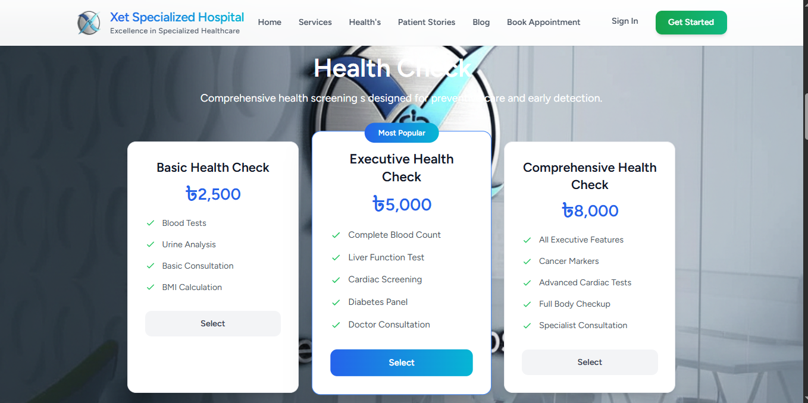
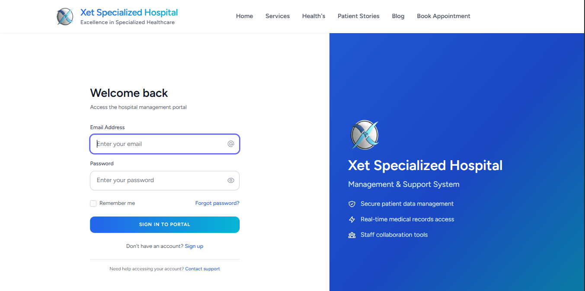
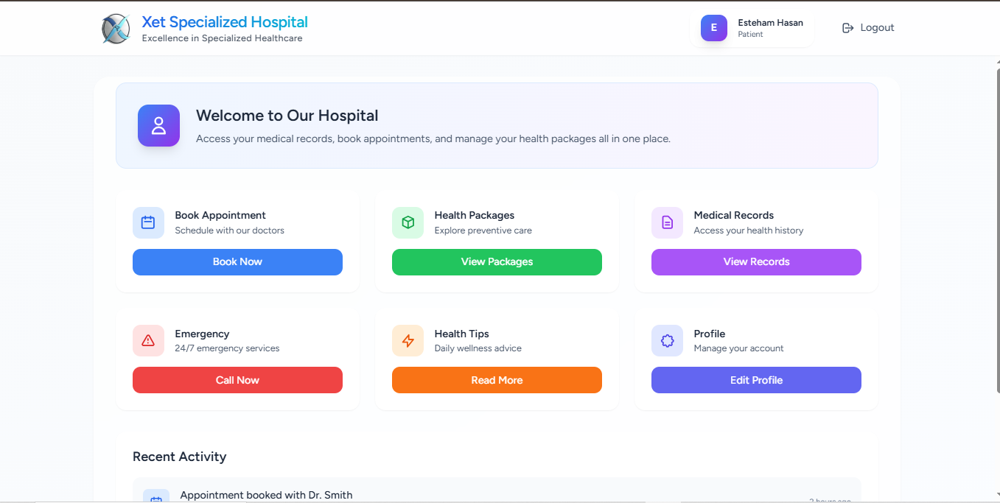
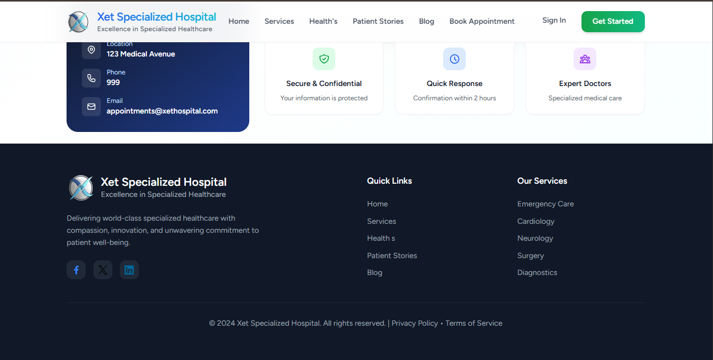

# Hospital Management

A modern **Hospital Management System** built with **Laravel** + **Vue 3** using **Vite**. It covers patient onboarding, appointments, doctors & departments, prescriptions, billing, inventory, and role-based admin features—designed for speed, clarity, and maintainability.










## ✨ Features

-   **Patient Management**: registration, profiles, history
-   **Appointments**: scheduling, status, notifications
-   **Doctors & Departments**: specialization, availability
-   **Billing & Payments**: invoices, discounts, receipt print
-   **Pharmacy / Inventory**: medicines, stock, suppliers
-   **Roles & Permissions**: admin, doctor, staff, accountant
-   **Search & Filters**: quick lookups everywhere
-   **Responsive UI**: Tailwind CSS, accessible components
-   **Fast Dev Experience**: Vue 3 + Vite 7, HMR

---

## 🧰 Tech Stack

-   **Backend**: Laravel 11 (PHP 8.2+), Laravel Sanctum/Passport (if API auth)
-   **Frontend**: Vue 3, @vitejs/plugin-vue, Axios
-   **Build**: Vite 7, laravel-vite-plugin 2.x
-   **UI**: Tailwind CSS 3.x, @tailwindcss/forms
-   **DB**: MySQL/MariaDB (or PostgreSQL)

> If you are using Inertia.js: `@inertiajs/vue3` is supported.

---

## ⚙️ Prerequisites

-   **PHP** 8.2+ and **Composer**
-   **Node.js** 18+ and **npm**
-   **MySQL** 8+ (or MariaDB/PostgreSQL)
-   **Git**


## 🧱 Vite / Vue / Tailwind Notes

-   Use **Vite 7** with **laravel-vite-plugin 2.x**
-   Use **@vitejs/plugin-vue 6.x** (compatible with Vite 7)
-   Use **Tailwind 3.x** (do **not** install `@tailwindcss/vite`, that’s for Tailwind v4)

**`postcss.config.cjs`**

```js
module.exports = {
    plugins: {
        tailwindcss: {},
        autoprefixer: {},
    },
};
```

**`tailwind.config.cjs`**

```js
module.exports = {
    content: [
        "./resources/**/*.blade.php",
        "./resources/**/*.js",
        "./resources/**/*.vue",
    ],
    theme: { extend: {} },
    plugins: [require("@tailwindcss/forms")],
};
```

**`vite.config.js`**

```js
import { defineConfig } from "vite";
import vue from "@vitejs/plugin-vue";
import laravel from "laravel-vite-plugin";

export default defineConfig({
    plugins: [
        vue(),
        laravel({
            input: ["resources/css/app.css", "resources/js/app.js"],
            refresh: true,
        }),
    ],
});
```

---

## 🗂 Suggested Structure (excerpt)

```
app/
bootstrap/
config/
database/
public/
resources/
  ├─ css/
  │   └─ app.css
  ├─ js/
  │   ├─ app.js
  │   └─ Pages/ (Vue SFCs)
  └─ views/ (Blade)
routes/
  ├─ web.php
  └─ api.php
```

---

## 🧪 Scripts

```json
"scripts": {
  "dev": "vite",
  "build": "vite build"
}
```

---

## 🩺 Troubleshooting

-   **Dependency conflicts (ERESOLVE)**
    Ensure: `vite@^7`, `@vitejs/plugin-vue@^6`, `laravel-vite-plugin@^2`.
-   **Tailwind PostCSS warning**
    Use `tailwindcss` and `autoprefixer` in `postcss.config.cjs` (no `@tailwindcss/vite` on Tailwind v3).
-   **Node version**
    Vite 7 requires Node **18+**.

---

## 🤝 Contributing

PRs and issues are welcome! Please describe the problem, steps to reproduce, and environment info.

---

## 📜 License

This project is open-source under the **MIT License**.

---

## 📧 Contact

Maintainer: **Esteham**
Repository: `https://github.com/esteham/hospital-management`

```

---

If you want, I can push these as a commit (message suggestion: `docs: add project README and short description`).
```
